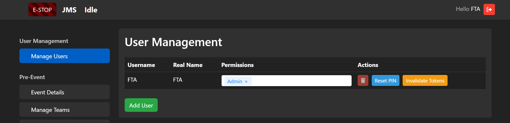
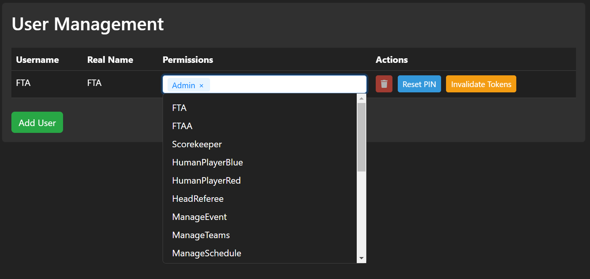

User Management
===============

**User Management** is where admins can manage the users in JMS. As JMS is controlled primarily through a web UI and not tied to a specific scorekeeping computer, it is important to make sure users have the appropriate permissions. 

At the start of your event, add a user for each user you wish to utilise JMS. For large events, you may opt to instead create a user for each role and share the PINs between volunteers.

.. note::
  Whether you assign a user per real person or a user per role is up to you and your level of risk acceptance. 

Roles
*****

Each user may have one or more roles which define their permissions. Certain features of JMS are gated behind these permissions and roles. Some roles, such as FTA, may imply a range of other permissions (such as Estop, ManageEvent, ManageTeams, etc).

Actions
*******

User Management provides a few mechanisms for management of each user:

- **Trash**: Delete this user
- **Reset PIN**: Prompt the user to assign a new PIN next time they login.
.. note::
  On first login, and when the Reset PIN button is pressed, the user may attempt to login with any PIN (including a blank string) and will then be prompted for a new PIN.
- **Invalidate Tokens**: Log out the user from all their existing sessions.