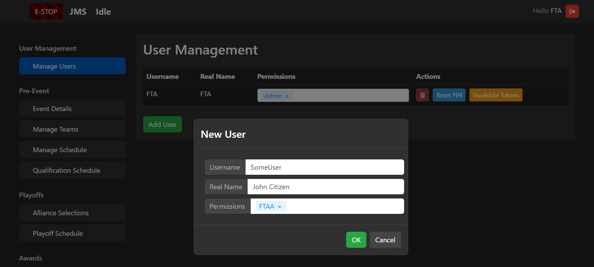
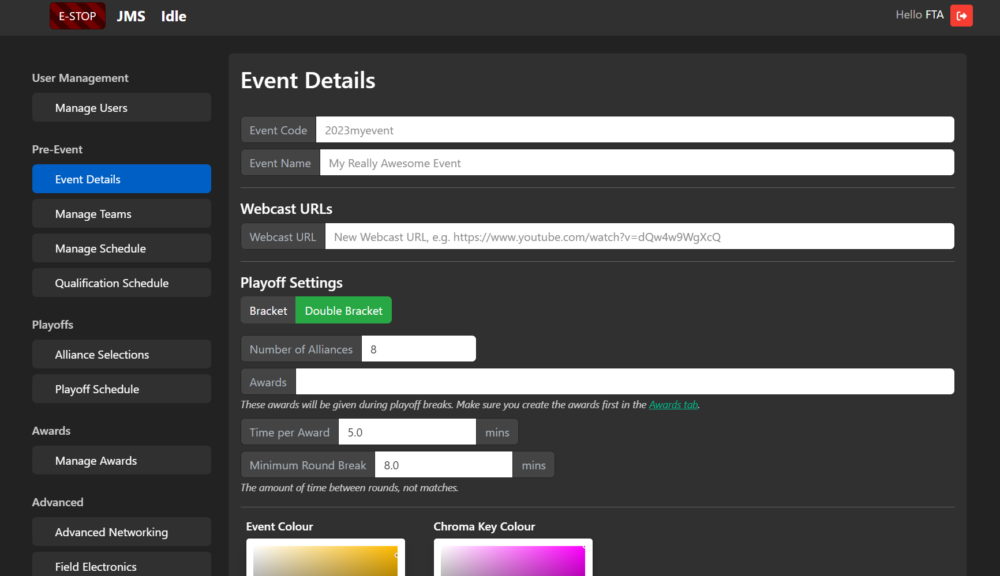
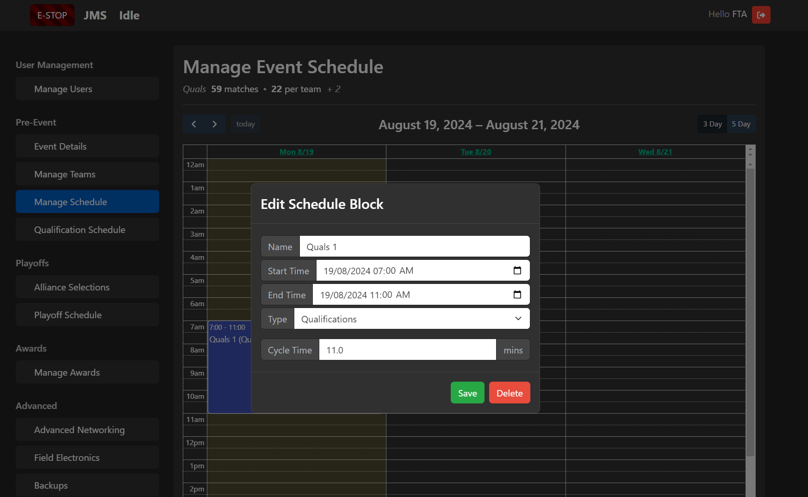
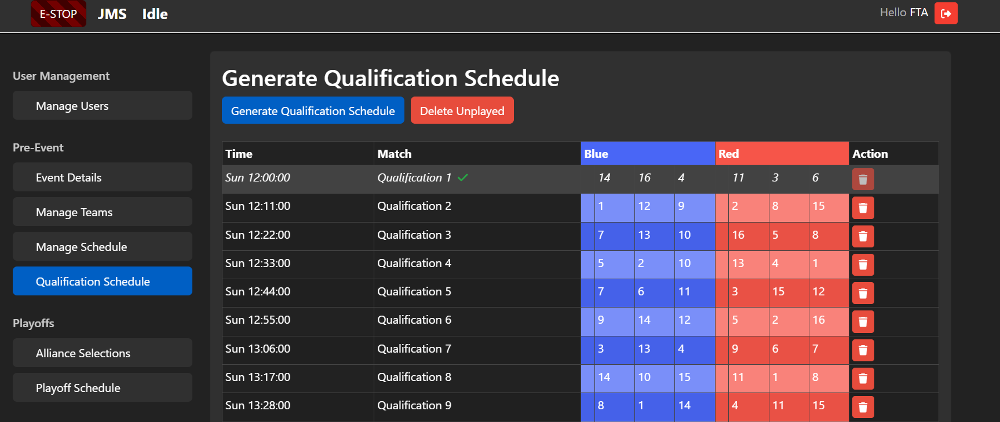
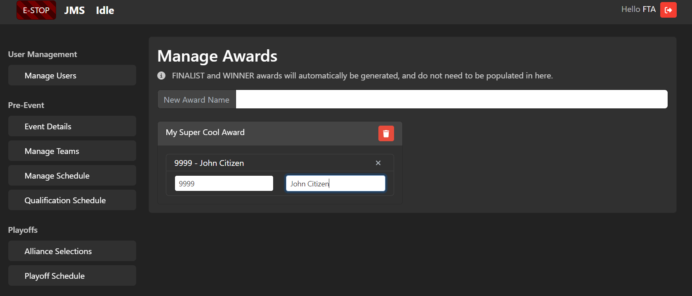

SCOREKEEPER - Event Setup
=========================

As Scorekeeper, you play a pivotal role in setting up JMS so the event runs smoothly. This guide will take you through the Event Wizard - the interface used to configure JMS for your event.

To access the Event Wizard, log into JMS (http://10.0.100.10/) and select the "Event Wizard" tile from the homepage.

.. warning::
  Don't configure anything in "Advanced" or "Integrations" - this should already be done by your FTA. The settings in here are usually to do with integrations with outside services and the field hardware. If you're unsure, chat to your FTA and they will guide you through it. 

.. warning::
  During event setup, make sure you **check with the FTA** before performing these steps. Although most steps are reversible, it's important the two of you are on the same page!

Managing Users
**************
Step 1 is to configure the users of the JMS software. Your FTA should have granted you admin access to JMS, and your volunteer coordinator should have given you a list of volunteers.

In the "User Management" pane, add each of the users who will be using JMS and assign them permissions. A general outline of roles and permissions is given below:

- **FTA** - Admin, FTA
- **FTAA** - FTAA
- **Head Referee** - Head Referee
- **Referee and Scorers** - Scoring, Estop
- **CSA** - Ticketing
- **AV** - ManageAudience

Game Announcers and the Audience Display can access their JMS screens without authentication.

.. note::
  In some games, such as CRESCENDO, Human Players may require a tablet to activate certain field elements. In this case, make a generic HPBlue and HPRed account with *only* the HumanPlayerBlue or HumanPlayerRed role! 

  You'll have to login to their account on their tablets, so make sure when you do that you set a memorable (but hard to guess) PIN.

Give each user their username and instruct them to login as soon as they can to set their PIN. For their first-time login, they can simply login with their username and a blank PIN.

Event Details
*************

Step 2 is to configure your event. The "Event Details" pane contains everything you need to set in regards to details about the event itself.

**Event Code** is the sync code used for your event. If your event is registered on TheBlueAlliance (TBA), this will be the same code in the URL of your event. If you're running a scrimmage or an event that doesn't sync to TBA, you can leave this blank or make one up in the format <year><code> (e.g. 2024auwarp). Just make sure it's not already taken!

**Event Name** is the event name that will display on all audience screens - make it short and sweet!

**Webcast URLs** are the URLs to where the event is being livestreamed, if any. These will be sync'd with TBA if configured.

**Playoff Settings** describe your playoff format. For most competitions post-2023, this should be a Double Bracket. Configure the number of alliances you wish to have, what awards you want to give out during the breaks, how long per award, and the minimum break between rounds.

.. note::
  You will have to enter the awards first on the "Manage Awards" pane. You don't have to do this *immediately*, but you should do it before the playoff schedule gets generated.

**AV Settings** are at the bottom and configure the look-and-feel of the Audience Display. Set these in collaboration with your A/V team.

Team Setup
**********

Next up is setting up the teams who will compete in your tournament. In the "Manage Teams" pane, you can either enter team details one-by-one or load them from a prepopulated CSV prepared by your event coordination team. 

You can edit any team details here at any point during the tournament, but you can only add and delete prior to generating the qualification schedule.

There's also an "Update from TBA" button for convenience, which will populate team name, affiliation, and location if they exist on TBA.

Manage Schedule
***************

Next up is configuring the event schedule. JMS provides a Google Calendar-esque interface for creating your schedule. You can go in as much or as little detail as you like, but the key parts are the Qualification match blocks and the Playoff match blocks. 

Click-and-drag to enter new blocks. For Qualification matches, you will have to specify a "cycle time" - the time between the start of one match and the start of the following match. Set this value in consultation with your FTA. Most regionals set this to be 7-8 minutes, however for most smaller offseasons 11 minutes is usually recommended.

.. note::
  Playoff matches will simply grow to the time alloted, so if you're finding your cycle time to be too rapid - try expanding your playoff blocks.

The top of the screen will show you the total amount of quals matches that will be played, as well as the amount of quals matches per team.

.. image:: imgs/schedule-counter.png
  :scale: 50%

Qualification Schedule
**********************

The next tab is to generate the Qualification Schedule. Hit the "Generate Qualification Schedule" button and configure your parameters.

.. note::
  Usually, you can leave these parameters at their default. Most schedules will generate in a matter of seconds, but you can optionally increase these values if you want to be extra sure your schedules are balanced.

After the schedule is generated, you can delete any unplayed matches. Once a match is played, however, it cannot be deleted.

.. important::
  If you change your schedule blocks / time allocation for qualification matches, you can update the quals schedule in one of two ways:

  **Keep what's been generated and just fill the extra space** by clicking "Generate Qualification Schedule", or

  **Scrap the unplayed matches and regenerate from scratch** by clicking "Delete Unplayed" first.

Alliance Selection and Playoffs
*******************************

At the conclusion of Qualifications, you can start the Alliance Selections process by going to the "Alliance Selections" tab. 

Here, you can move add teams to and move teams between alliances. There's a handy "Promote Captains" button for when alliances pick another alliance's captain, which will the subsequent alliance captains up in rank and invite the next ranked team. 

.. important::
  Any changes you make here will show on the Audience Display immediately!

The Playoff Schedule should manage itself from this point forth, however you can manually force an update by going to the "Playoff Schedule" tab and selecting "Update Playoff Schedule".

Assign Awards
*************

You can create and assign awards in the "Manage Awards" pane. To create a new award, simply type its name into the "New Award Name" field and hit "Enter". From here, you can also assign awardees.

.. important::
  The WINNER and FINALIST awards will be automatically generated, so there's no need to add them in here.

.. warning::
  Make sure your screen is clear from prying eyes whilst on this pane!

Awards can then be displayed from the "Audience Display Controls" tile on the homepage.