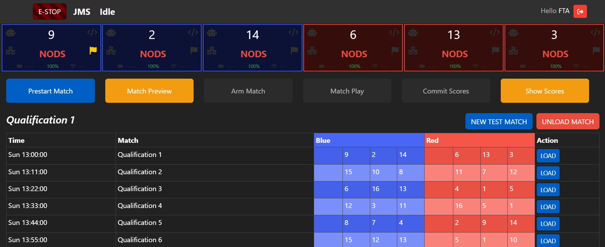
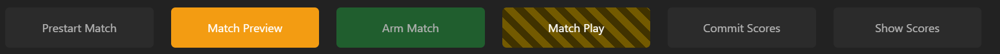

SCOREKEEPER
===========

As a scorekeeper, your job is to configure JMS, make sure that the matches are flowing, and to manage scoring. you're the "hands-on-keyboard" of the fta and the head referee. 

To get started, familiarise yourself with The JMS UI: :doc:`/full-walkthrough/00-navigation/index`

Once you know about all the peripheral elements, let's get started by looking at how you use JMS to perform your role.

Configure JMS
*************
On setup day, your job is to work with the FTA to configure JMS. See :doc:`before-the-event` to see how this is done.

.. toctree::
  :hidden:
  
  before-the-event

Keep Matches Running
********************
As scorekeeper, your main role is to control the flow of matches. Working closely with the FTA you'll load matches, prestart the field, arm the field, run the match, and submit the scores. Crucially, you'll work together with the FTA to keep matches running on time whilst maintaining the proper order to match flow.

The FTA screen will be your main control center. As the name implies, the FTA also has access to this screen. 

In this screen, you will be able to LOAD and UNLOAD matches, including creating new test matches for purposes such as practice day. The schedule will automatically populate and update as more matches are played, but it's up to you to load in the matches as required.

Team Boxes
##########

In the top of the screen, you have the statuses of each driver station. These contain the team number, the state of their communication, and a quick diagnostic showing the most urgent error. 

.. image:: imgs/team-status.png

Most of this is self-explanatory, and will be monitored closely by your FTA and FTAAs. If you notice any element of this as red, or if the diagnosis says anything except OK, notify your FTA if they aren't already aware - that team may be having issues!

The "Flagged for CSA Followup" icon will turn yellow if this team has been flagged by the FTA or FTAA for CSA followup. This usually means the team has had a communications issue in the past, and will let you know to keep a close eye on them to see if the issue is resolved.

Clicking on this box, more actions and information is shown.

.. image:: imgs/team-status-info.png

From this menu, you can change the team number if required, bypass the team if instructed by the FTA, emergency stop the team (not the whole field), or flag the team for CSA follow-up. A list of previous CSA issues for the team is also shown here, providing more information than just the yellow flag.

Match Flow Ribbon
#################

The Match Flow Ribbon contains everything you need to run matches. 

PRESTART
^^^^^^^^
The first button is the PRESTART button. Clicking this puts the field into PRESTART, where it configures the networking equipment, team signs, and all other facets of the field that need to be ready to engage teams. Once prestarted, this button changes to REVERT PRESTART, which allows you to make changes to the teams or driver stations, and also enables the unload match button.

.. note::
  Your FTA may ask you to re-PRESTART in some circumstances. Usually, this is done to reset the field networking in the case a team is struggling to connect. To do this, REVERT PRESTART followed by a PRESTART.

MATCH PREVIEW
^^^^^^^^^^^^^
The next button displays the MATCH PREVIEW on the Audience Display, showing the lineup of teams competing. 

ARM MATCH
^^^^^^^^^
The middle button is the ARM MATCH button. This button declares the field UNSAFE and ready to start the match. You should only ARM the match when instructed by the FTA, since everyone needs to be clear of the field by this point.

MATCH PLAY
^^^^^^^^^^
The next button is the MATCH PLAY button. Only click this when given the **THUMBS UP** from the FTA. This button will start a 3-second countdown and then automatically start the match. The 3 second window will allow you to abort the match start by hitting the |estop| button.

.. note::
  The THUMBS UP is a process that is undertaken just before a match is started. All relevant FIELD STAFF will put their "thumbs up" when their element of the field is ready to go. As scorekeeper, the only thumb that matters to you is the FTA, who will in turn check on everyone else. 

  When the FTA's thumb goes up, the game announcer will start a countdown. When this countdown starts, hit "MATCH PLAY", but keep your eyes on the FTA. If the FTA's thumb drops for any reason during this countdown, **immediately E-Stop the match**. After the countdown is complete and the robots are moving, the FTA is free to drop their thumb without the scorekeeper triggering an E-Stop.

COMMIT SCORES
^^^^^^^^^^^^^
After the match is over, wait for the Head Referee before hitting the COMMIT SCORES button. The Head Referee will let you know when the scores are ready. This button commits the scores into the database, updates team rankings, and if configured will update TheBlueAlliance. 

.. note::
  The COMMIT SCORES button won't update the Audience Display, as you may want to wait for the Game Announcer. 

SHOW SCORES
^^^^^^^^^^^
The SHOW SCORES button will display the most recent scores on the Audience Display.

Manage Scoring
****************
From time to time, you may be instructed by the Head Referee to amend a score from a previous match, or to edit the live scores prior to committing the scores. In collaboration with the Head Referee, you can do this by clicking on the "Edit Scores" tile on the home page.

.. image:: imgs/edit-scores.png

From this page, you can modify all elements of the scores for both the Live scores (the current, uncommitted match) or historical scores from committed matches. All changes are tracked, meaning you can also view any previous editions of the scores.

The total score and ranking points are calculated for you, but can be overridden using the overrides and adjustments at the bottom of each alliance's score window.

Any applied changes will automatically recalculate the rankings and push the changes to TheBlueAlliance if configured.